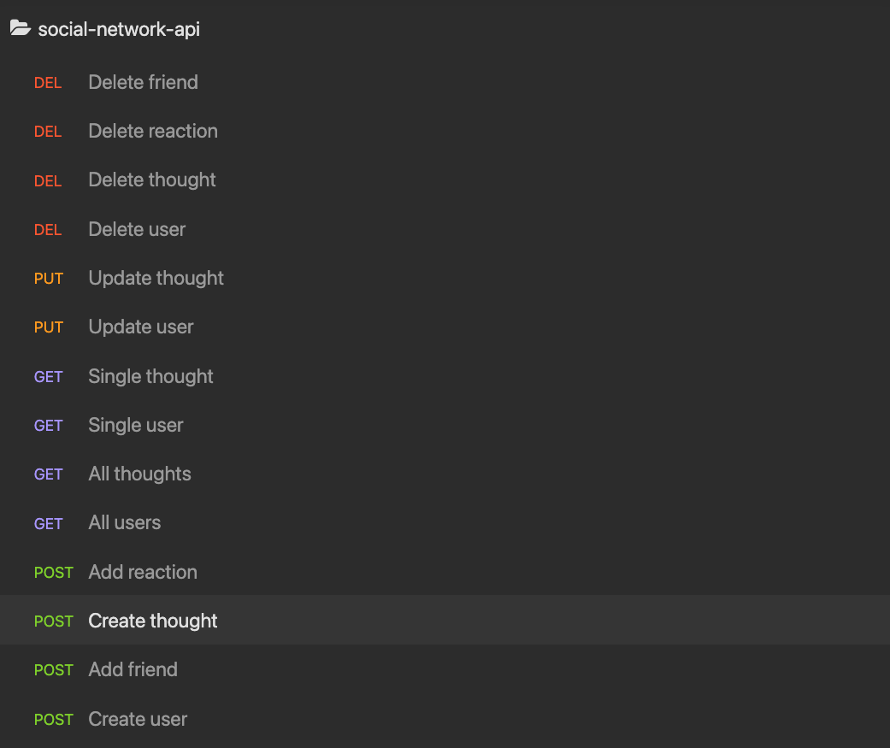

# social-network-API

[Demo Video](https://drive.google.com/file/d/11IUYt0sTR27-NZeLrsYdP62It-0AAZ04/view)

## Description

An API for a social network web application where users can share their thoughts, react to friends’ thoughts, and create a friend list. The application uses Express.js for routing, a MongoDB database, and the Mongoose ODM. 

## Questions

My GitHub: [flokamp](https://github.com/flokamp)

If you have additional questions, email me! kampflo2@gmail.com
